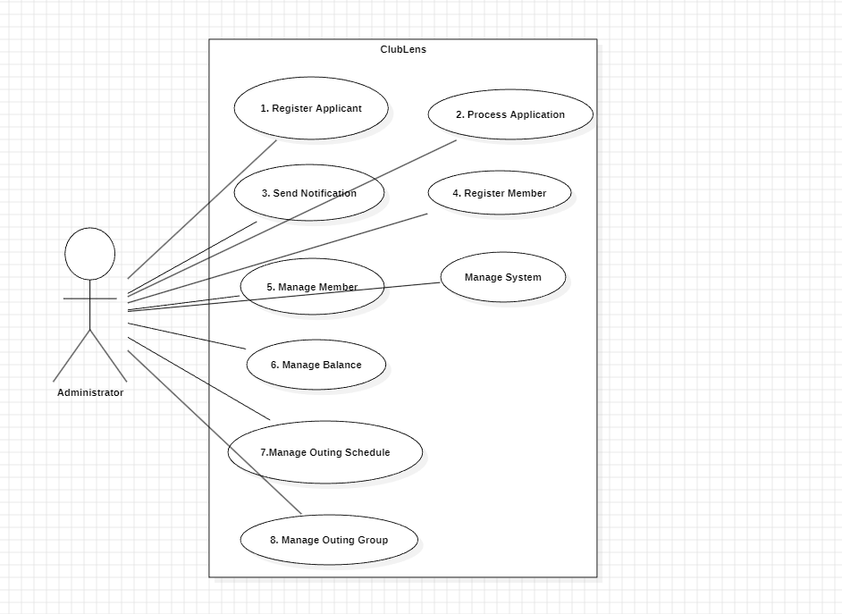
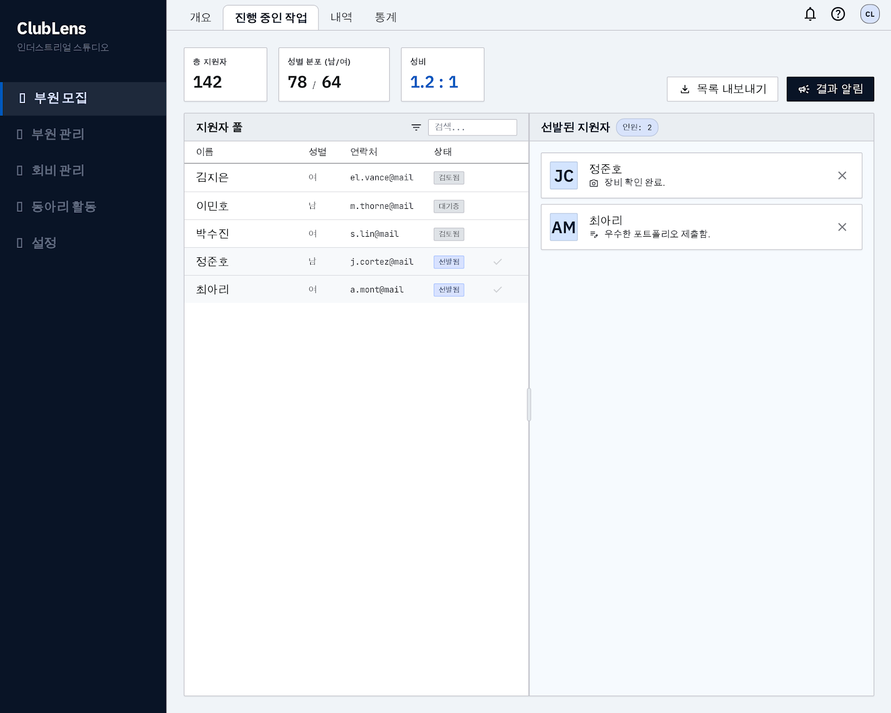
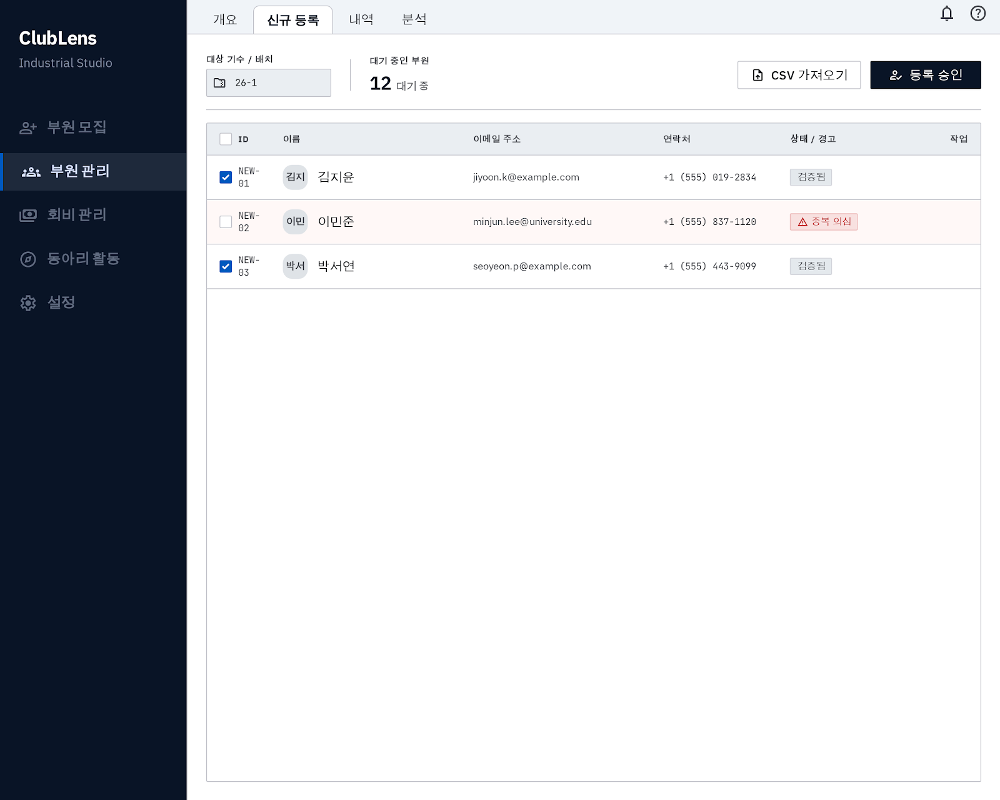
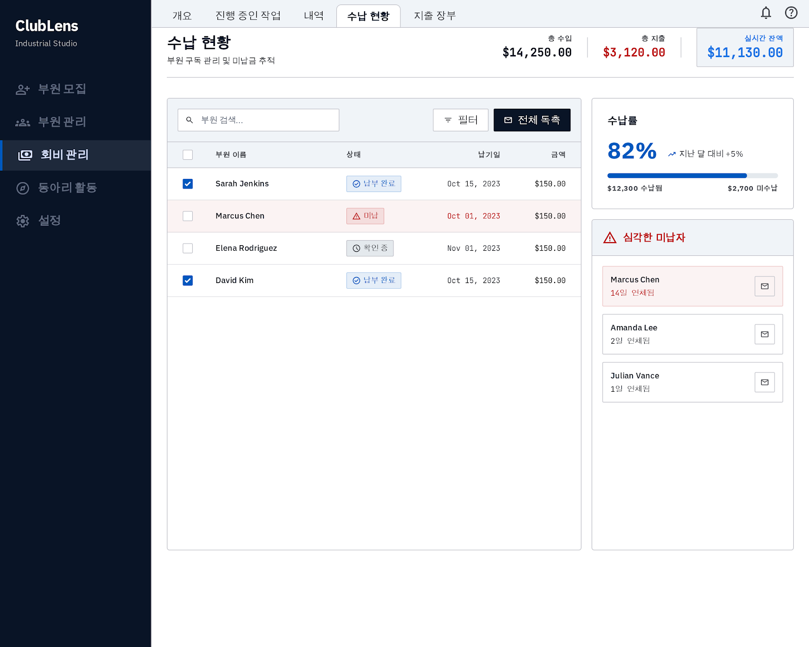
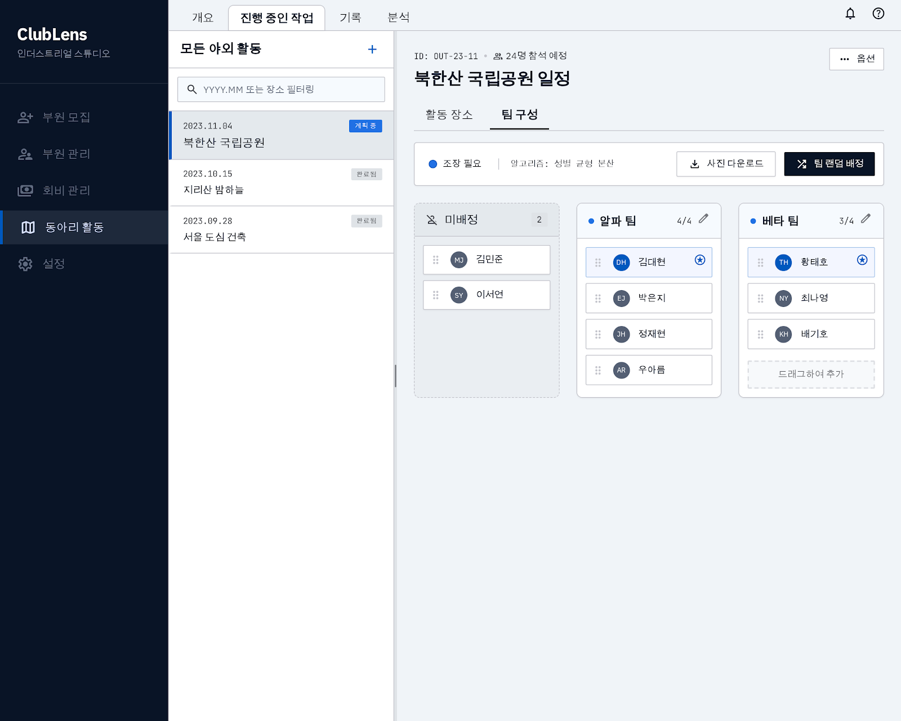
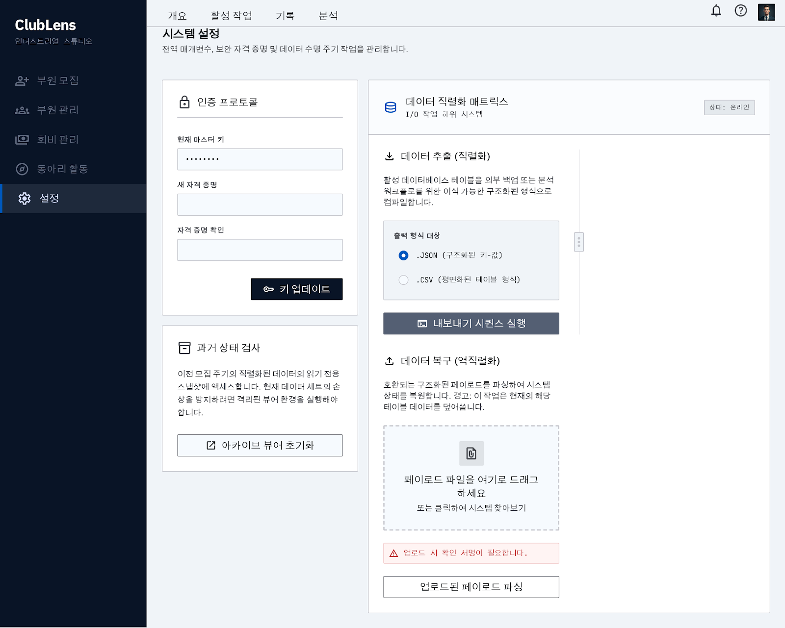

# ClubLens
## 동아리 종합 관리 시스템 - Analysis Report

---

| | |
|---|---|
| Student No. | 22212008 |
| Name | 이충호 |
| E-mail | chmy020417@gmail.com |

---

## [ Revision History ]

| Revision date | Version # | Description | Author |
|---|---|---|---|
| 2026-05-08 | 1.0.0 | First Draft | 이충호 |
| | | | |
| | | | |

---

## = Contents =

1. Introduction
2. Use Case Analysis
3. Domain Analysis
4. User Interface Prototype
5. Glossary
6. References

---

## 1. Introduction

본 프로젝트를 통해 개발하고자 하는 ClubLens는 사진 동아리의 복잡한 운영 업무(지원자 관리, 정식 부원 승격, 회비 장부, 출사 조 편성)를 효율적으로 통합 관리하는 소프트웨어이다. 본 보고서는 시스템 요구사항을 분석하여 '시스템이 무엇을 하는가'를 정의하고, 객체 간의 유기적인 관계를 Domain 및 Use Case 분석을 통해 상세히 기술한다. 특히 사용자의 편의성을 극대화한 UI 설계와 데이터 보존을 위한 효율적인 아키텍처를 제안함으로써 실무적인 동아리 관리 솔루션을 제시하고자 한다.

---

## 2. Use Case Analysis

### 2.1 Use Case Diagram

### 2.2 Use Case Descriptions

---

| Use Case #1 : Register Applicant |  |
| :--- | :--- |
| **GENERAL CHARACTERISTICS** |  |
| Summary | 가두모집 시 확보한 종이 지원서를 참조하여 신입 지원자의 정보를 시스템에 연속적으로 등록함 |
| Scope | ClubLens |
| Level | User Level |
| Author | 이충호 |
| Last Update | 2026-05-08 |
| Status | Analysis |
| Primary Actor | Administrator |
| Preconditions | 시스템 로그인 완료 및 '신입 모집' 페이지 접속 |
| Trigger | 관리자가 '지원자 등록' 메뉴를 선택함 |
| Success Post Condition | 지원자 정보가 DB에 저장되고 하이픈이 자동 삽입됨 |
| Failed Post Condition | 입력 데이터가 저장되지 않으며 기존 목록 유지 |
| **MAIN SUCCESS SCENARIO** |  |
| Step | Action |
| 1 | '지원자 등록' 메뉴를 클릭함 |
| 2 | 이름, 연락처, 성별, 특이사항을 입력함 |
| 3 | '저장 후 다음' 버튼을 클릭함 |
| 4 | 연락처에 하이픈을 삽입하여 저장하고 입력창을 초기화함 |
| **EXTENSION SCENARIOS** |  |
| Step | Branching Action |
| 3a | 필수 항목 누락 시 |
| 3a.1 | 시스템은 경고 메시지를 출력하고 해당 필드를 강조함 |
| 3b | 연락처 형식 오류 시 |
| 3b.1 | 시스템은 유효성 확인 메시지를 출력하고 수정을 요구함 |
| **RELATED INFORMATION** |  |
| Performance | ≦ 1 sec |
| Frequency | High (모집 기간) |
| Concurrency | 1 (Local) |
| Due Date | 2026-05-08 |

---

| Use Case #2 : Process Application |  |
| :--- | :--- |
| **GENERAL CHARACTERISTICS** |  |
| Summary | 지원자 리스트를 확인하며 선발 인원을 확정하여 합격 예정자 명단으로 이동시킴 |
| Scope | ClubLens |
| Level | User Level |
| Author | 이충호 |
| Last Update | 2026-05-08 |
| Status | Analysis |
| Primary Actor | Administrator |
| Preconditions | 등록된 지원자 데이터가 1건 이상 존재함 |
| Trigger | 관리자가 '합격자 선발' 메뉴를 선택함 |
| Success Post Condition | 선발된 인원의 상태가 'Selected'로 변경되고 합격자 명단이 생성됨 |
| Failed Post Condition | 선발 결과가 저장되지 않음 |
| **MAIN SUCCESS SCENARIO** |  |
| Step | Action |
| 1 | '합격자 선발' 메뉴를 호출함 |
| 2 | 왼쪽 지원자 목록에서 선발할 인원을 확인하고 선택함 |
| 3 | 시스템이 인원을 오른쪽 합격 명단으로 이동시키고 성비를 업데이트함 |
| 4 | '선발 확정' 버튼을 클릭함 |
| **EXTENSION SCENARIOS** |  |
| Step | Branching Action |
| 2a | 동명이인 식별 필요 시 |
| 2a.1 | 이름 클릭 시 상세 정보 팝업을 통해 정보를 대조함 |
| 3a | 실수 방지 팝업 활성화 시 |
| 3a.1 | 이동 시마다 확인 팝업을 출력함 |
| **RELATED INFORMATION** |  |
| Performance | ≦ 1 sec |
| Frequency | High (모집 기간) |
| Concurrency | 1 (Local) |
| Due Date | 2026-05-08 |

---

| Use Case #3 : Send Notification |  |
| :--- | :--- |
| **GENERAL CHARACTERISTICS** |  |
| Summary | 선발된 합격자와 불합격자에게 통보 메시지를 작성하고 발송 여부를 관리함 |
| Scope | ClubLens |
| Level | User Level |
| Author | 이충호 |
| Last Update | 2026-05-08 |
| Status | Analysis |
| Primary Actor | Administrator |
| Preconditions | Use Case #2(선발 확정) 단계가 완료됨 |
| Trigger | 관리자가 '결과 통보' 메뉴를 선택함 |
| Success Post Condition | 모든 대상자의 발송 상태가 '완료'로 업데이트됨 |
| Failed Post Condition | 발송 상태가 기록되지 않음 |
| **MAIN SUCCESS SCENARIO** |  |
| Step | Action |
| 1 | '결과 통보' 하위 탭으로 진입함 |
| 2 | 합격/불합격 탭별로 템플릿을 수정함 |
| 3 | 대상자를 선택한 후 '전송' 버튼을 클릭함 |
| 4 | 전송 완료된 대상자 옆에 초록색 체크 표시를 출력함 |
| **EXTENSION SCENARIOS** |  |
| Step | Branching Action |
| 3a | 수동 발송 시 |
| 3a.1 | 명단 옆 '수동 체크' 버튼을 클릭함 |
| 3a.2 | 시스템은 상태를 '발송 완료'로 시각화함 |
| **RELATED INFORMATION** |  |
| Performance | ≦ 1 sec |
| Frequency | High (모집 기간) |
| Concurrency | 1 (Local) |
| Due Date | 2026-05-08 |

---

| Use Case #4 : Register Member |  |
| :--- | :--- |
| **GENERAL CHARACTERISTICS** |  |
| Summary | 합격자들에게 기수를 일괄 부여하고 기존 활동 부원 DB(Member)로 즉시 병합함 |
| Scope | ClubLens |
| Level | User Level |
| Author | 이충호 |
| Last Update | 2026-05-08 |
| Status | Analysis |
| Primary Actor | Administrator |
| Preconditions | 결과 통보를 마친 합격 인원 데이터가 존재함 |
| Trigger | 관리자가 '정식 부원 등록' 메뉴를 선택함 |
| Success Post Condition | 합격자가 'Member' 객체로 변환되어 기존 명단에 병합됨 |
| Failed Post Condition | 기존 명단에 병합되지 않고 기존 상태 유지 |
| **MAIN SUCCESS SCENARIO** |  |
| Step | Action |
| 1 | '정식 부원 등록' 탭으로 진입함 |
| 2 | 기수 일괄 부여 버튼으로 현재 기수(예: 26-1)를 입력함 |
| 3 | 기존 부원 DB와 이름 중복 여부를 대조함 |
| 4 | 이름 클릭 후 상세 팝업 확인을 통해 '이름(뒷4자리)' 식별자를 확정함 |
| 5 | '등록 확정' 버튼을 클릭하여 명단을 통합함 |
| **EXTENSION SCENARIOS** |  |
| Step | Branching Action |
| 4a | 중복 발생 시 |
| 4a.1 | 상세 정보 팝업으로 본인 확인 수행 |
| 4a.2 | 식별자 규격(괄호 형태)을 강제 적용함 |
| **RELATED INFORMATION** |  |
| Performance | ≦ 1 sec |
| Frequency | High (모집 기간) |
| Concurrency | 1 (Local) |
| Due Date | 2026-05-08 |

---

| Use Case #5 : Manage Member |  |
| :--- | :--- |
| **GENERAL CHARACTERISTICS** |  |
| Summary | 활동 부원의 정보를 수정, 검색하거나 학기 말 인원 정리(물갈이)를 수행함 |
| Scope | ClubLens |
| Level | User Level |
| Author | 이충호 |
| Last Update | 2026-05-08 |
| Status | Analysis |
| Primary Actor | Administrator |
| Preconditions | 시스템 내 등록된 부원 정보가 존재함 |
| Trigger | 관리자가 '부원 관리' 페이지에 접속함 |
| Success Post Condition | 부원 정보가 최신화되거나 활동 명단이 갱신됨 |
| Failed Post Condition | 수정된 정보가 저장되지 않음 |
| **MAIN SUCCESS SCENARIO** |  |
| Step | Action |
| 1 | 부원 명단 페이지에 접속함 |
| 2 | 이름 검색 또는 필터를 사용하여 부원을 선택함 |
| 3 | 연락처, 학과 등 정보를 수정함 |
| 4 | 수정 완료 후 페이지 이탈 시 저장 여부를 확인하는 팝업을 띄움 |
| 5 | 학기 말 '정기 인원 정리' 버튼으로 다음 학기 명단을 확정함 |
| **EXTENSION SCENARIOS** |  |
| Step | Branching Action |
| 4a | 저장 취소 시 |
| 4a.1 | 변경된 내용을 파기하고 원래 상태로 복구함 |
| 5a | 인원 정리 시 |
| 5a.1 | 데이터 아카이브 전 최종 경고 팝업을 출력함 |
| **RELATED INFORMATION** |  |
| Performance | ≦ 1 sec |
| Frequency | Medium |
| Concurrency | 1 (Local) |
| Due Date | 2026-05-08 |

---

| Use Case #6 : Manage Balance |  |
| :--- | :--- |
| **GENERAL CHARACTERISTICS** |  |
| Summary | 회비 수납 상태를 체크하고 지출 내역을 기록하여 실시간 잔액을 산출함 |
| Scope | ClubLens |
| Level | User Level |
| Author | 이충호 |
| Last Update | 2026-05-08 |
| Status | Analysis |
| Primary Actor | Administrator |
| Preconditions | 활동 부원 명단이 구성되어 있음 |
| Trigger | 관리자가 '회비 관리' 라벨을 선택함 |
| Success Post Condition | 납부 여부 및 지출 내역이 반영되어 잔액이 업데이트됨 |
| Failed Post Condition | 장부 데이터가 저장되지 않음 |
| **MAIN SUCCESS SCENARIO** |  |
| Step | Action |
| 1 | '회비 관리' 전용 페이지에 접속함 |
| 2 | 부원 이름 옆 체크박스로 납부 상태를 갱신함 |
| 3 | 지출 장부 탭에서 품목과 금액을 입력함 |
| 4 | 실시간으로 산출된 현재 잔액을 확인함 |
| **EXTENSION SCENARIOS** |  |
| Step | Branching Action |
| 2a | 미납자 필터링 시 |
| 2a.1 | 미납자 보기 옵션을 활성화하여 리스트를 재구성함 |
| **RELATED INFORMATION** |  |
| Performance | ≦ 1 sec |
| Frequency | Medium |
| Concurrency | 1 (Local) |
| Due Date | 2026-05-08 |

---

| Use Case #7 : Manage Outing Schedule |  |
| :--- | :--- |
| **GENERAL CHARACTERISTICS** |  |
| Summary | 출사 목록을 관리하고 특정 출사의 상세 코스를 등록함 |
| Scope | ClubLens |
| Level | User Level |
| Author | 이충호 |
| Last Update | 2026-05-08 |
| Status | Analysis |
| Primary Actor | Administrator |
| Preconditions | '출사 관리' 홈 화면에 접속함 |
| Trigger | 관리자가 출사 목록에서 특정 항목을 클릭함 |
| Success Post Condition | 상세 페이지 내 [출사지] 탭에 코스 정보가 저장됨 |
| Failed Post Condition | 일정 정보가 저장되지 않음 |
| **MAIN SUCCESS SCENARIO** |  |
| Step | Action |
| 1 | 내림차순으로 정렬된 출사 목록에서 일정을 선택함 |
| 2 | 상단에 생성된 [출사지] 세부 탭을 클릭함 |
| 3 | 후보지 및 이동 코스를 입력함 |
| 4 | 저장 버튼을 클릭하여 일정을 확정함 |
| **EXTENSION SCENARIOS** |  |
| Step | Branching Action |
| 1a | 새 출사 추가 시 |
| 1a.1 | 새로 만들기 버튼을 클릭하여 일정 객체를 생성함 |
| **RELATED INFORMATION** |  |
| Performance | ≦ 1 sec |
| Frequency | Medium |
| Concurrency | 1 (Local) |
| Due Date | 2026-05-08 |

---

| Use Case #8 : Manage Outing Group |  |
| :--- | :--- |
| **GENERAL CHARACTERISTICS** |  |
| Summary | 성비 기반 자동 조 편성 초안을 생성하고 드래그 앤 드롭으로 수동 조정함 |
| Scope | ClubLens |
| Level | User Level |
| Author | 이충호 |
| Last Update | 2026-05-08 |
| Status | Analysis |
| Primary Actor | Administrator |
| Preconditions | 출사 상세 페이지 내부에 위치함 |
| Trigger | 관리자가 [조 편성] 세부 탭을 클릭함 |
| Success Post Condition | 조 편성 결과가 이미지 또는 텍스트로 저장됨 |
| Failed Post Condition | 조 편성 데이터가 손실됨 |
| **MAIN SUCCESS SCENARIO** |  |
| Step | Action |
| 1 | 카톡 투표 결과를 바탕으로 참석 부원을 체크함 |
| 2 | '랜덤 조 편성' 버튼으로 성비 균형 초안을 생성함 |
| 3 | 부원 이름을 커서로 드래그 앤 드롭하여 조를 재배치함 |
| 4 | '사진 다운' 버튼으로 최종 결과를 내보냄 |
| **EXTENSION SCENARIOS** |  |
| Step | Branching Action |
| 3a | 인원 불균형 발생 시 |
| 3a.1 | 시스템은 특정 조의 인원 편중을 경고 아이콘으로 알림 |
| **RELATED INFORMATION** |  |
| Performance | ≦ 1 sec |
| Frequency | Medium |
| Concurrency | 1 (Local) |
| Due Date | 2026-05-08 |

---

| Use Case #9 : Manage System |  |
| :--- | :--- |
| **GENERAL CHARACTERISTICS** |  |
| Summary | 비밀번호 관리, 데이터 추출(백업)/복구 및 과거 아카이브를 관리함 |
| Scope | ClubLens |
| Level | User Level |
| Author | 이충호 |
| Last Update | 2026-05-08 |
| Status | Analysis |
| Primary Actor | Administrator |
| Preconditions | 관리자 권한으로 시스템 설정에 접속함 |
| Trigger | 관리자가 '시스템 설정' 메뉴를 선택함 |
| Success Post Condition | 비밀번호 변경 및 데이터 백업/복구 작업이 완료됨 |
| Failed Post Condition | 데이터 추출 실패 또는 복구 실패 |
| **MAIN SUCCESS SCENARIO** |  |
| Step | Action |
| 1 | 비밀번호 변경 메뉴에서 새 암호를 설정함 |
| 2 | '데이터 추출'로 전체 DB를 암호화된 파일로 생성함 |
| 3 | 임원 교체 시 추출된 파일을 사용하여 데이터를 복구함 |
| 4 | 과거 학기별 아카이브 기록을 조회함 |
| **EXTENSION SCENARIOS** |  |
| Step | Branching Action |
| 3a | 백업 없이 초기화 시 |
| 3a.1 | 강한 경고 팝업을 출력하여 데이터 소실을 방지함 |
| **RELATED INFORMATION** |  |
| Performance | ≦ 1 sec |
| Frequency | Low |
| Concurrency | 1 (Local) |
| Due Date | 2026-05-08 |

---

## 3. Domain Analysis

1\) Person

추상 클래스(Abstract Class)다. 모든 인원(부원/지원자)의 공통 신상 정보를 관리하며 Member와 Applicant의 상위 클래스 역할을 한다. 공통 속성으로 `name`, `studentId`, `contact`, `gender`를 정의하여 하위 클래스 간의 데이터 일관성을 유지한다.

2\) Member

부원 클래스다. Person을 상속받으며 활동 중인 정식 부원의 학사 및 동아리 기수 정보를 관리하는 클래스다. 합격자 발생 시 Applicant 객체의 공통 정보를 생성자의 인자로 전달받아 새 객체로 변환(Promotion)하며, 추가 속성으로 `major`, `generation`, `status`(활동/휴학)를 가진다.

3\) Applicant

지원자 클래스다. Person을 상속받으며 신입 모집 단계의 지원 정보 및 선발 상태를 관리하는 클래스다. 속성으로 `appliedTerm`, `memo`, `result`(합격/불합격/미정)를 가지며, 합격 처리 시 해당 객체의 공통 정보가 Member 생성자로 전달된다.

4\) Outing

출사 클래스다. 출사 일정, 유형 및 전체 코스 경로를 관리하는 클래스다. 속성으로 `date`, `type`(정기/카페/행사/기타)을 가지며, 코스 경로는 CourseNode를 요소로 하는 `courseList`(Linked List)로 관리한다. OutingFee와 ID로 연결되어 해당 출사의 참가비 현황을 추적한다.

5\) CourseNode

코스 노드 클래스다. 출사 코스의 개별 지점 정보 및 이동 데이터를 기록하는 클래스다. 장소의 순서가 엄격히 유지되어야 하고 중간 삽입/삭제 효율성이 필요하므로 Linked List의 노드로 설계되었다. 속성으로 `locationName`, `note`(메모), `travelTime`(이동 시간)을 가진다.

6\) GeneralFinance

일반 회비 클래스다. 학기별 정기 회비 납부 명단과 동아리 전체 잔액을 관리하는 메인 장부 역할을 하는 클래스다. OutingFee와 분리하여 이중 구조를 구성함으로써 정기 회비 관리의 투명성을 확보한다. 속성으로 `duesYearTerm`, `payerList`, `totalBalance`를 가진다.

7\) OutingFee

출사 참가비 클래스다. 특정 Outing 객체와 `outingId`로 연결되어 해당 출사의 참가비 수납 현황만 독립적으로 추적하는 클래스다. GeneralFinance와 분리된 이중 구조를 통해 특정 출사 참여 부원의 참가비 납부 여부를 즉시 확인할 수 있다. 속성으로 `outingId`, `feeAmount`, `paidMemberList`를 가진다.

---

## 4. User Interface Prototype

아래 화면 디자인은 현재 기획 단계의 프로토타입으로,
실제 구현 과정에서 레이아웃, 구성 요소, 기능 등이 변경될 수 있습니다.

1\) 부원 모집 (RecruitmentPanel)

화면 상단에는 총 지원자 수, 성별 분포(남/여), 성비가 실시간으로 표시된다. 화면은 왼쪽의 지원자 풀과 오른쪽의 선발된 지원자 영역으로 나뉜다. 왼쪽 목록에서 지원자를 선택하면 오른쪽 선발 명단으로 이동하며, 선발 결과는 '결과 알림' 버튼을 통해 통보 준비 화면으로 연결된다. 목록 내보내기 기능으로 지원자 전체 목록을 파일로 저장할 수 있다.

2\) 부원 관리 (MemberPanel)

화면 상단에는 대상 기수 및 배치 정보와 현재 대기 중인 부원 수가 표시된다. 목록에는 각 부원의 ID, 이름, 이메일, 연락처, 상태가 함께 표시되며, 동명이인이 있는 경우 '중복 의심' 경고 표시가 나타난다. 체크박스로 여러 부원을 동시에 선택할 수 있으며, '등록 승인' 버튼으로 선택한 인원을 정식 부원으로 확정한다. CSV 가져오기 기능으로 외부 파일의 부원 정보를 불러올 수 있다.

3\) 회비 관리 (FinancePanel)

화면 상단에는 총 수입, 총 지출, 실시간 잔액이 한눈에 표시된다. 중앙 목록에는 부원별 납부 상태(납부 완료 / 미납 / 확인 중)와 납기일, 금액이 표시되며, 체크박스로 납부 여부를 직접 체크할 수 있다. 우측에는 전체 수납률이 퍼센트로 표시되고, 미납 기간이 긴 부원을 '심각한 미납자' 목록으로 따로 강조하여 보여준다. 상단 탭에서 수납 현황과 지출 장부를 전환할 수 있다.

4\) 동아리 활동 - 조 편성 (OutingPanel)

화면 왼쪽에는 날짜 및 장소 기준으로 정렬된 출사 목록이 표시되며, 각 항목의 진행 상태(계획 중 / 완료됨)가 함께 표시된다. 출사 항목을 선택하면 오른쪽에 해당 출사의 상세 화면이 나타나며, '활동 장소'와 '팀 구성' 탭으로 전환할 수 있다. '팀 구성' 탭에서는 '팀 랜덤 배정' 버튼으로 성비 균형을 고려한 자동 배분 초안이 생성된다. 생성된 초안에서 부원 이름을 드래그하여 다른 팀으로 이동시키는 방식으로 수동 조정이 가능하다. 편성이 완료되면 '사진 다운로드' 버튼으로 결과를 이미지 파일로 저장할 수 있다.

5\) 설정 (SettingsPanel)

화면은 크게 두 영역으로 나뉜다. 왼쪽에는 비밀번호 변경 영역과 과거 기록 조회 영역이 있다. 비밀번호 변경은 현재 비밀번호 확인 후 새 비밀번호를 입력하는 방식으로 동작하며, 임원 교체 시 사용한다. 과거 기록 조회는 이전 모집 주기의 데이터를 불러오는 기능으로, '아카이브 뷰어 초기화' 버튼을 통해 접근한다. 오른쪽에는 데이터 저장 및 복구 영역이 있다. '데이터 추출' 기능으로 전체 데이터를 JSON 또는 CSV 형식의 파일로 저장할 수 있으며, '데이터 복구' 기능으로 저장된 파일을 불러와 시스템 데이터를 복원할 수 있다. 복구 시 현재 데이터가 덮어씌워지므로 실행 전 확인 절차가 필요하다.

---

## 5. Glossary

| 용어 | 설명 |
| :--- | :--- |
| ClubLens | 본 프로젝트의 명칭으로, '동아리(Club)'를 렌즈처럼 투명하게 관리한다는 의미를 담음. |
| Promotion (승격) | Applicant 객체가 합격 판정 후 Member 객체로 변환되어 정식 부원으로 등록되는 객체 전이 과정. |
| Chrome-style Tab | 크롬 브라우저의 인터페이스를 벤치마킹하여, 현재 활성화된 세부 작업 탭을 회색 음영으로 강조하는 UI 구조. |
| BCE 패턴 | 시스템을 경계(Boundary), 제어(Control), 개체(Entity)로 분리하여 유지보수성을 높이는 설계 기법. |
| 직렬화 (Serialization) | 메모리 상의 객체 데이터를 파일 형태(.JSON, .CSV)로 변환하여 로컬 저장소에 저장하는 기술. |

---

## 6. References

[1] "Entity-control-boundary", Wikipedia. (https://en.wikipedia.org/wiki/Entity-control-boundary). (BCE 패턴 관련 설계 원칙 참고)

[2] "Java Serialization", Oracle Documentation. (객체 데이터의 로컬 저장 및 직렬화 방식 참고)
