# ClubLens
## 동아리 종합 관리 시스템 - Conceptualization Report

---

|---|---|
| Student No. | 22212008 |
| Name | 이충호 |
| E-mail | chmy020417@gmail.com |

---

## [ Revision History ]

| Revision date | Version # | Description | Author |
|---|---|---|---|
| 2026.03.27 | 1.0.0 | First Draft | 이충호 |
| | | | |
| | | | |

---

## = Contents =

1. [Business Purpose]
2. [System Context Diagram]
3. [Use Case List]
4. [Concept of Operation]
5. [Problem Statement]
6. [Glossary]
7. [References]

---

## 1. Business Purpose

### 1) Project Background

대학교 내 동아리는 단순한 친목 모임을 넘어, 정기적인 활동과 체계적인 운영이 필요한 하나의 조직이다. 특히 사진 동아리와 같이 정기적인 외부 활동(출사)과 신입부원 모집, 회비 관리 등 다양한 행정 업무가 동반되는 동아리의 경우, 임원들의 업무 부담이 상당하다.

영남대학교 사진 동아리 "사우회"를 예로 들면, 매 학기 초 가두모집을 통해 신입부원을 모집하고, 지원서를 수기로 검토하여 합격자를 선발한 뒤 개별적으로 문자를 발송하는 과정을 거친다. 이후 선발된 부원들의 정보는 별도의 프로그램으로 관리되며, 매월 정기 출사 시 조 편성과 회비 수납 역시 임원이 수작업으로 처리하고 있다. 이러한 방식은 정보가 여러 곳에 분산되어 관리 효율이 낮고, 임원 교체 시 인수인계가 어렵다는 문제점이 있다.

이러한 불편함을 해소하고자, 동아리 운영에 필요한 모든 기능을 하나의 시스템으로 통합한 동아리 종합 관리 프로그램 **ClubLens** 를 개발하고자 한다.

### 2) Goal

- 신입부원 모집부터 선발, 통보까지의 과정을 시스템화하여 임원의 행정 업무를 줄인다.
- 부원 정보, 회비, 출사 일정 및 조 편성을 하나의 시스템에서 통합 관리한다.
- 누구나 쉽게 사용할 수 있는 인터페이스를 제공하여 임원 교체 시에도 원활한 인수인계가 가능하도록 한다.

### 3) Target Market

정기적인 활동과 신입부원 모집이 있는 대학교 내 소규모~중규모 동아리를 주 대상으로 한다. 특히 정기 외부 활동(출사, 답사, 봉사 등)이 있어 조 편성과 회비 관리가 빈번하게 발생하는 동아리에 적합하다.

---

## 2. System Context Diagram

**Actors:**
- **Administrator (임원)** : 시스템의 주 사용자. 부원 관리, 출사 관리, 회비 관리 등 모든 기능을 사용한다.
- **Applicant (지원자)** : 가두모집 시 임원이 대신 정보를 등록하며, 시스템에 직접 접근하지 않는다.

**Use Cases:**
- RegisterApplicant
- ProcessApplication
- SendNotification
- RegisterMember
- ManageMember
- ManageBalance
- ManageOutingSchedule
- ManageOutingGroup
- ManageSystem

---

## 3. Use Case List

### 1) Register Applicant

| | |
|---|---|
| **Actor** | Administrator |
| **Description** | 가두모집 기간 중 임원이 종이 지원서를 보고 지원자의 이름, 연락처, 성별을 시스템에 등록한다. 지원서 자체는 종이로 유지하여 동아리 고유의 헤리티지를 보존한다. |

### 2) Process Application

| | |
|---|---|
| **Actor** | Administrator |
| **Description** | 임원들이 오프라인에서 대면 논의 후 합격자를 결정하고, 임원 한 명이 시스템에 합격/불합격 여부를 입력한다. 합격 처리 시 성비(남/여)가 실시간으로 업데이트된다. |

### 3) Send Notification

| | |
|---|---|
| **Actor** | Administrator |
| **Description** | 합격자 전체와 불합격자 전체에게 각각 다른 템플릿으로 문자를 일괄 발송한다. 템플릿은 합격용/불합격용으로 각각 미리 저장되어 있으며, 발송 전 내용 수정이 가능하다. |

### 4) Register Member

| | |
|---|---|
| **Actor** | Administrator |
| **Description** | Process Application에서 합격 처리된 인원이 자동으로 연동된다. 임원이 학번, 학과를 추가 입력하여 정식 부원으로 확정하며, 가입 학기가 자동으로 기록된다. |

### 5) Manage Member

| | |
|---|---|
| **Actor** | Administrator |
| **Description** | 전체 부원 정보를 조회, 추가, 수정, 삭제한다. Register Member에서 등록된 인원이 자동으로 연동되며, 직접 신규 부원을 추가하거나 탈퇴 처리할 수 있다. 부원 목록은 이름순, 학번순, 가입 학기순으로 정렬할 수 있다. |

### 6) Manage Balance

| | |
|---|---|
| **Actor** | Administrator |
| **Description** | 학기별 회비 납부 현황을 관리한다. 납부/미납부/전체 탭으로 구분하여 표시하며, 체크박스 형식으로 납부 여부를 체크한다. 학기 초기화 기능으로 이전 학기 회비 기록을 삭제할 수 있다. |

### 7) Manage Outing Schedule

| | |
|---|---|
| **Actor** | Administrator |
| **Description** | 출사 일정을 등록, 수정, 삭제한다. 날짜, 장소, 출사 종류(정기 출사/카페 출사)를 기록하며, 출사 기록은 영구 보존된다. 출사 일정 선택 시 해당 출사의 조 편성 화면으로 이동할 수 있다. |

### 8) Manage Outing Group

| | |
|---|---|
| **Actor** | Administrator |
| **Description** | 출사별 조 편성을 관리한다. 자동 균등 배분으로 초안을 생성하고 드래그로 수동 조정이 가능하다. 카페 출사의 경우 1라운드 조 편성 완료 후 조장을 고정한 채 나머지 인원을 재배분하는 2라운드 조 편성을 진행한다. 조 편성 결과는 이미지로 저장할 수 있다. |

### 9) Manage System

| | |
|---|---|
| **Actor** | Administrator |
| **Description** | 시스템 보안 및 데이터 관리를 담당한다. 앱 실행 시 비밀번호를 입력해야 접근할 수 있으며, 비밀번호 변경이 가능하다. 데이터 백업 및 복원 기능을 제공하여 데이터 손실에 대비한다. |

---

## 4. Concept of Operation

### 1) Register Applicant

| | |
|---|---|
| **Purpose** | 가두모집 시 지원자 정보를 시스템에 등록 |
| **Approach** | 임원이 종이 지원서를 보고 지원자의 이름, 연락처, 성별을 시스템에 입력한다. 지원서 자체는 종이로 유지하여 동아리 고유의 헤리티지를 보존한다. |
| **Dynamics** | 가두모집 기간 중 임원이 지원자 정보를 시스템에 등록할 때 |
| **Goals** | 지원자 정보를 시스템에 등록하여 이후 합격자 선발 및 문자 발송에 활용할 수 있도록 한다. |

### 2) Process Application

| | |
|---|---|
| **Purpose** | 지원자 목록을 검토하여 합격/불합격 처리 |
| **Approach** | 임원들이 오프라인에서 대면 논의 후 합격자를 결정하고, 임원 한 명이 시스템에 합격/불합격 여부를 입력한다. 합격 처리할 때마다 성비(남/여)가 화면에 실시간으로 업데이트된다. |
| **Dynamics** | 임원들이 오프라인 논의를 마치고 합격자를 시스템에 반영할 때 |
| **Goals** | 합격/불합격 처리 및 성비 현황을 한눈에 확인하여 균형 잡힌 신입부원 선발이 가능하도록 한다. |

### 3) Send Notification

| | |
|---|---|
| **Purpose** | 합격/불합격 결과를 지원자에게 문자로 일괄 발송 |
| **Approach** | 합격자 전체와 불합격자 전체에게 각각 다른 템플릿으로 문자를 일괄 발송한다. 템플릿은 합격용/불합격용으로 각각 미리 저장되어 있으며, 발송 전 내용 수정이 가능하다. 개별 문자 발송이 필요한 경우 기존 방식을 병행하여 사용한다. |
| **Dynamics** | 합격/불합격 처리가 완료된 후 결과를 지원자에게 통보할 때 |
| **Goals** | 합격/불합격 문자를 일괄 발송하여 임원의 개별 문자 발송 부담을 줄인다. |

### 4) Register Member

| | |
|---|---|
| **Purpose** | 합격자를 정식 부원으로 등록 |
| **Approach** | Process Application에서 합격 처리된 인원이 자동으로 연동된다. 임원이 학번, 학과를 추가 입력하여 정식 부원으로 확정한다. 가입 학기(예: 25년 1학기)가 자동으로 기록된다. |
| **Dynamics** | 합격자가 정식 부원으로 확정된 후 상세 정보를 등록할 때 |
| **Goals** | 합격자를 정식 부원으로 등록하여 이후 부원 관리 및 회비 관리에 활용할 수 있도록 한다. |

### 5) Manage Member

| | |
|---|---|
| **Purpose** | 전체 부원 정보를 조회, 추가, 수정, 삭제 |
| **Approach** | Register Member에서 등록된 인원이 자동으로 연동된다. 임원이 직접 신규 부원을 추가하거나 기존 부원 정보를 수정 및 탈퇴 처리할 수 있다. 부원 목록은 이름순, 학번순, 가입 학기순(학기별 그룹으로 묶어서 표시)으로 정렬할 수 있다. |
| **Dynamics** | 임원이 부원 정보를 조회하거나 수정, 탈퇴 처리가 필요할 때 |
| **Goals** | 전체 부원 정보를 한눈에 파악하고 효율적으로 관리할 수 있도록 한다. |

### 6) Manage Balance

| | |
|---|---|
| **Purpose** | 학기별 회비 납부 현황 관리 |
| **Approach** | 별도 화면으로 회비 관리 화면을 오픈한다. 이름과 체크박스 형식으로 납부 여부를 체크하며 체크 해제도 가능하다. 전체/납부/미납부 탭 3개로 구분하여 표시한다. 기존 부원은 2(8)월 말~3(9)월 초, 신입 부원은 가두모집 후 3(9)월 중순에 회비를 수납한다. 학기 초기화 기능으로 이전 학기 회비 기록을 전체 삭제할 수 있다. |
| **Dynamics** | 학기 초 회비 수납 시 또는 납부 현황을 확인할 때 |
| **Goals** | 회비 납부/미납부 현황을 한눈에 파악하여 임원의 회비 관리 부담을 줄인다. |

### 7) Manage Outing Schedule

| | |
|---|---|
| **Purpose** | 출사 일정 등록, 수정, 삭제 및 기록 관리 |
| **Approach** | 임원이 날짜, 장소(지역 단위 및 출사지 이름, 순서대로), 출사 종류(정기 출사/카페 출사)를 입력하여 일정을 등록한다. 등록된 출사 기록은 영구적으로 보존되어 이전 출사 기록을 언제든지 조회할 수 있다. 출사 일정 선택 시 해당 출사의 조 편성 화면으로 이동할 수 있다. |
| **Dynamics** | 출사 일정을 등록하거나 이전 출사 기록을 조회할 때 |
| **Goals** | 출사 일정을 체계적으로 관리하고 이전 출사 기록을 보존하여 동아리의 활동 히스토리를 축적한다. |

### 8) Manage Outing Group

| | |
|---|---|
| **Purpose** | 출사별 조 편성 및 관리 |
| **Approach** | 출사 일정 선택 후 조 편성 화면으로 이동한다. 자동 균등 배분으로 초안을 생성하고 임원이 드래그로 수동 조정할 수 있다. 각 부원은 카드 형태로 표시되며 조마다 다른 색상으로 구분된다. 첫 번째 자리가 조장임을 암묵적 규칙으로 유지한다. 조 편성 결과는 이미지로 저장할 수 있다. 카페 출사의 경우 1라운드 조 편성(성비 및 신입/기존 부원 비율 고려) 완료 후 2라운드 조 편성을 진행하며, 조장은 고정되고 나머지 인원만 재배분된다. |
| **Dynamics** | 출사 전 임원이 조 편성을 진행할 때 |
| **Goals** | 균등하고 균형 잡힌 조 편성을 효율적으로 진행하고 결과를 저장하여 공지에 활용할 수 있도록 한다. |

### 9) Manage System

| | |
|---|---|
| **Purpose** | 시스템 보안 및 데이터 백업 관리 |
| **Approach** | 앱 실행 시 비밀번호를 입력해야 접근할 수 있다. 임원 교체 시 비밀번호 변경이 가능하다. 데이터 백업 기능으로 전체 데이터를 외부 파일로 저장할 수 있으며, 불러오기 기능으로 백업 데이터를 복원할 수 있다. |
| **Dynamics** | 앱 최초 실행 시 또는 임원 교체, 데이터 백업이 필요할 때 |
| **Goals** | 외부 접근을 차단하고 데이터 손실을 방지하여 안전하게 시스템을 운영할 수 있도록 한다. |

---

## 5. Problem Statement

ClubLens는 사진 동아리 임원들이 부원 모집부터 출사 관리까지 동아리 운영 전반을 효율적으로 관리할 수 있도록 돕는 임원 전용 관리 프로그램이다. 이 시스템은 다음과 같은 목적을 달성해야 한다.

- 신입부원 모집 및 선발 과정의 체계적 관리
- 부원 정보의 통합 관리 및 데이터 보존
- 출사 일정 및 조 편성의 효율적 관리
- 회비 납부 현황의 투명한 관리

### 1) Problem #1 - 문자 발송 기능의 제약

실제 문자 발송을 위해서는 외부 문자 발송 서비스와의 연동이 필요하다. 해당 서비스는 별도의 비용이 발생하므로 본 시스템의 구현 범위에서 제외한다. 따라서 Send Notification 기능은 발송 대상 목록 확인 및 템플릿 관리까지만 구현하며, 실제 문자 발송은 기존 방식을 병행하여 사용한다.

### 2) Problem #2 - 데스크탑 전용 환경

본 시스템은 데스크탑 환경에서만 동작하도록 설계된다. 따라서 모바일 기기나 웹 브라우저를 통한 접근이 불가능하며, 시스템이 설치된 임원 PC에서만 사용할 수 있다. 부원들의 직접적인 시스템 접근은 고려하지 않으며, 임원 전용 관리 툴로서의 역할에 집중한다.

### 3) Problem #3 - 단일 사용자 환경

본 시스템은 단일 사용자 환경으로 설계되어 여러 임원이 동시에 접근하거나 실시간으로 데이터를 공유하는 것이 불가능하다. 임원 간 데이터 공유가 필요한 경우 백업 기능을 통해 수동으로 이전해야 한다.

### 4) Problem #4 - 로컬 데이터 저장

별도의 서버 없이 데이터를 로컬에 저장하는 방식을 채택한다. 따라서 시스템이 설치된 환경이 변경되거나 데이터 손실이 발생할 경우 백업 기능을 통해 데이터를 복원해야 한다. 정기적인 백업을 통해 데이터 손실을 최소화할 것을 권장한다.

---

## 6. Glossary

| Terms | Description |
|-------|-------------|
| 가두모집 | 학기 초 교내에서 신입부원을 모집하는 활동 |
| 정기 출사 | 매월 한 번 조를 꾸려 출사지로 이동하여 사진 촬영을 하는 정기 활동 |
| 카페 출사 | 학기 초 신입부원과 기존 부원의 친목을 위해 카페에서 진행하는 활동. 1라운드와 2라운드로 조가 나뉨 |
| 학기 초기화 | 새 학기 시작 시 이전 학기의 회비 납부 기록을 삭제하는 기능 |
| 백업 | 시스템 데이터를 외부 파일로 저장하여 데이터 손실에 대비하는 기능 |

---

